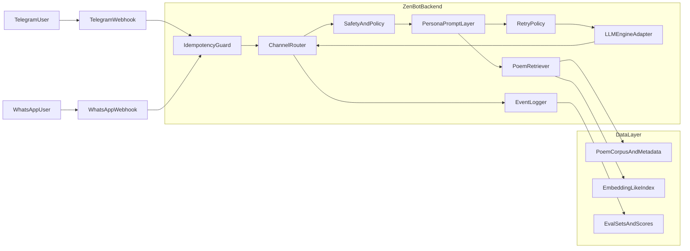

# Zen Bot Architecture

## System Overview

## Key Decisions

- **Channel unification:** channel-specific payload parsing is isolated in package modules; the app processes one normalized message type.
- **LLM portability:** provider selection is configured via environment variables and wrapped in a fallback engine.
- **Grounding-first responses:** retrieval context is injected before model generation, and citation presence is enforced.
- **Operational resilience:** duplicate message protection, bounded retry behavior, and structured event logs are built in.

## Request Flow

1. Channel webhook receives payload.
2. Parser converts channel payload into a unified message.
3. Idempotency guard drops duplicates.
4. Safety policy checks prompt.
5. Retriever selects best poem snippets and citations.
6. LLM adapter generates answer with fallback providers.
7. Output policy trims response and ensures citation.
8. API returns channel-ready response payload.

